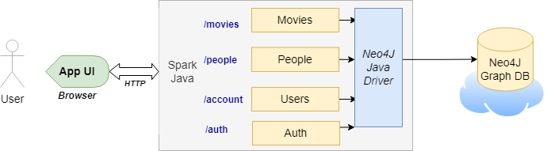
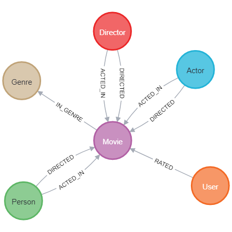
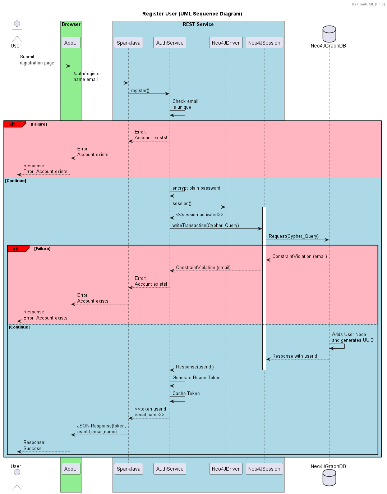

:toc:

= Building Neo4j Applications with Java

== Introduction

Prepared as part of link:https://graphacademy.neo4j.com/courses/app-java/[Building Neo4j Applications with Java course^].

== Setup
See link:./setup.adoc[Setup Instructions^]

== Functional Requirements

- Allows registration of new users. Access is password controlled (basic authentication).
- Supports paginated listing of people (actors, directors).
- Supports paginated listing of people similar to a given person.
- Supports paginated listing of movies similar to a given movie.

== High Level Diagram

link:./src/main/java/neoflix/NeoflixApp.java[App] configures routes.

== Data Model

=== Nodes (Entities)

[width="80%",cols="3,20",options="header"]
|=========================================================
|Node |Description
|Movie  | node (entity) represents a movie, and node properties contain release date, title, etc.
|People | node (entity) represents an actor or a director in movies. Node properties contain birth year. Director and Actors are possible labels. These additional labels improve queries when Actor or Director nodes are in query criteria.
|Genre  | node (entity) represents a genre. Node properties contain type of genre.
|Users  | node (entity) represents a user who rated movies. Node properties contain user's name, email, password, etc.
|=========================================================

=== Relationships (edges)

[width="80%",cols="3,20",options="header"]
|=========================================================
|Relationship |Description
|ACTED_IN  | a relationship (edge) from People node to Movie node and represents that a people (source node) acted in a movie (target node).
Properties of relationship contain role. A person can act in multiple movies. A person can have multiple roles in the same movie.
|DIRECTED | a relationship (edge) from People node to Movie node and represents that a people (source node) directed a movie (target node).
Each director can direct multiple movies. A person can direct multiple movies.
Each movie can have multiple directors.
|GENRE_IN  | a relationship (edge) from a Movie node to a Genre node and represents which genres a movie has.
Each movie can have multiple genre (cardinality).
|RATED  | a relationship (edge) from a User node to a Movie node. Represents rating of movie by a user.
Properties of relationship contain a rating and timestamp of rating event.
Each user rates a movie at most once (constraint).
|=========================================================

Obtained by *CALL db.schema.visualization* in Neo4J Browser by using Neo4J DB with Recommendations data set.
Director and Actor are additional labels in Person node.

== Application Interface

=== API : Register User

POST /auth/register

[width="80%",cols="10,40,10,40",options="header"]
|=========================================================
2+| Input Parameters         2+| Output Parameters
| *Name* | *Description*       | *Name* | *Description*
| name   | User's name         | name   | User's name
| email  | User's email        | email  | User's email
| password | User's credential | token  | Bearer Token
|          |                   | userId | User's unique identifier
|=========================================================

=== API : Authenticate User

POST /auth/authenticate

[width="80%",cols="10,40,10,40",options="header"]
|=========================================================
2+| Input Parameters         2+| Output Parameters
| *Name*   | *Description*     | *Name* | *Description*
| name     | User's name       | name   | User's name
| password | User's credential | email  | User's email
|          |                   | token  | Bearer Token
|          |                   | userId | User's unique identifier
|=========================================================

=== API : Get paginated list of people

GET /people/

==== Cypher Query

A response returns all properties of Person nodes (Line 2).
A request contains a property to be used in sorting and order of sorting (Line 3).
Line 4 and 5 handle pagination.

--------------------------------------
1: MATCH (p:Person)
2: RETURN p { .* } AS person
3: ORDER BY p.%s %s
4: SKIP $skip
5: LIMIT $limit
--------------------------------------

=== API : Get paginated list of people similar to the given person

GET /people/:id/similar

==== How to quantify similarity?
Similarity between two Person nodes is quantified by the number of common Movie nodes
reached via ACTED_IN or DIRECTED edges.

==== Cypher Query

Line 1 selects Person nodes who have a connection to Movie node a given person acted in or directed.
Line 3 projects all properties of matched Person node.
Line 4 counts the number of ACTED_IN edges from matched Person node to common Movie nodes.
Line 5 counts the number of DIRECTED edges from matched Person node to common Movie nodes.
Line 6 collects the title, and id properties of common Movie nodes.
Line 8 uses the number of common Movie nodes to order by similarity.
Line 9 and 10 handle pagination.

Note that (actedCount+directedCount)>size(person.inCommon) is possible
because a person can be an actor and a director as well as
a person can have multiple roles in the same movie.

--------------------------------------
 1: MATCH (:Person {tmdbId: $id})-[:ACTED_IN|DIRECTED]->(m)<-[r:ACTED_IN|DIRECTED]-(p)
 2: RETURN p {
 3: .*,
 4: actedCount: size((p)-[:ACTED_IN]->()),
 5: directedCount: size((p)-[:DIRECTED]->()),
 6: inCommon: collect(m {.tmdbId, .title, type: type(r)})
 7: } AS person
 8: ORDER BY size(person.inCommon) DESC
 9: SKIP $skip
10: LIMIT $limit
--------------------------------------

=== API: Get paginated list of movies that the given person acted in

GET /people/:id/acted

==== Cypher Query

A person can act in *multiple movies*.
A person can have multiple roles in the same movie, hence, there can be multiple ACTED_IN edges between the same person and the same movie nodes.
The endpoint /people/:id/acted captures this one-to-many relationship.
A request contains Id of a person (Line 1).
A response returns all properties of matching movie nodes (Line 3).
A request contains a property to be used in sorting and order of sorting (Line 4).
Line 5 and 6 handle pagination.

--------------------------------------
1: MATCH (:Person {tmdbId: $id})-[:ACTED_IN]->(m:Movie)
2: WHERE m.`%s` IS NOT NULL
3: RETURN m { .* } AS movie
4: ORDER BY m.`%s` %s
5: SKIP $skip
6: LIMIT $limit
--------------------------------------

=== API: Get paginated list of movies that the given person directed

GET /people/:id/directed

==== Cypher Query

A person can direct *multiple movies*.
The endpoint /people/:id/directed captures this one-to-many relationship.
A request contains Id of a person (Line 1).
A response returns all properties of matching movie nodes (Line 3).
A request contains a property to be used in sorting and order of sorting (Line 4).
Line 5 and 6 handle pagination.

--------------------------------------

1: MATCH (:Person {tmdbId: $id})-[:DIRECTED]->(m:Movie)
2: WHERE m.`%s` IS NOT NULL
3: RETURN m { .* } AS movie
4: ORDER BY m.`%s` %s
5: SKIP $skip
6: LIMIT $limit
--------------------------------------

=== API: Get paginated list of reviewers of a given movie

GET /movies/:id/ratings

==== Cypher Query

Line-1 has the movie identifier.
Line 4-9 collects properties from RATED relationship and user node.
Line 10, sorts the response by using the projected properties (in review).
The first %s is a placeholder for the property and the second %s is a placeholder for order (ASC/DESC) of sorting.
Line 11-12 contain pagination logic in Cypher QL.

--------------------------------------
 1: MATCH (u:User)-[r:RATED]->(m:Movie {tmdbId: $id})
 2: WHERE u.name IS NOT NULL
 3: RETURN r {
 4:        .rating,
 5:        .timestamp,
 6:        user: u {
 7:                .userId, .name
 8:            }
 9:        } AS review
10: ORDER BY r.%s %s
11: SKIP $skip
12: LIMIT $limit
--------------------------------------

=== API: Get paginated list of movies similar to the given movie

==== How to quantify similarity?

Similarity between two Movie nodes is quantified by the number of common actors, directors, and genre.
This number is scaled by imdbRating.

==== Cypher Query

Line 1 picks the connected movies nodes to given movie (id) via ACTED_IN, DIRECTED, or IN_GENRE edges.
Line 2 filters out movie nodes with empty imdbRating property.
Line 3 finds the count of common actors, directors, and genres.
Line 4 calculates similarity score (=imdbRating * inCommon).
Line 5 sorts movie nodes based on similarity score.
Line 8-11 projects all properties of movie node and appends score.

--------------------------------------
 1: MATCH (:Movie {tmdbId: $id})-[:IN_GENRE|ACTED_IN|DIRECTED]->()<-[:IN_GENRE|ACTED_IN|DIRECTED]-(m)
 2: WHERE m.imdbRating IS NOT NULL
 3: WITH m, count(*) AS inCommon
 4: WITH m, inCommon, m.imdbRating * inCommon AS score
 5: ORDER BY score DESC
 6: SKIP $skip
 7: LIMIT $limit
 8: RETURN m {
 9:     .*,
10:     score: score,
11: } AS movie
--------------------------------------

== Tools

=== Development

- Used link:https://sparkjava.com/[Spark Java^] as Microservices framework to build REST APIs.
- Used link:https://neo4j.com/developer/java[Neo4j Java Driver^] to connect to Neo4j Graph database instance, and link:https://neo4j.com/product/cypher-graph-query-language/[Cypher^] to query.
- Authentication is handled with link:https://github.com/auth0/auth0-java[Auth0^] and link:https://jwt.io/[JWT Tokens^]
- Passwords are encrypted and verified with link:https://javadoc.io/doc/at.favre.lib/bcrypt/latest/index.html[bcrypt^]. Stored encrypted password in database.

=== Testing

- Testing is performed using link:https://junit.org/junit5/[JUnit5^]

=== Documentation

- Used link:https://asciidoc-py.github.io/index.html[Asciidoc^] to document.
- Used link:https://plantuml.com/[PlantUML^] to add documentation in UML.
- Used link:https://app.diagrams.net/[Draw.io^]

=== Notes

- *movieId* is an identifier for movies used by https://movielens.org. E.g., the movie Toy Story has the link https://movielens.org/movies/1.
- *imdbId* is an identifier for movies used by http://www.imdb.com. E.g., the movie Toy Story has the link http://www.imdb.com/title/tt0114709/.
- *tmdbId* is an identifier for movies used by https://www.themoviedb.org. E.g., the movie Toy Story has the link https://www.themoviedb.org/movie/862.
- link:https://portal.graphgist.org/graph_gists/flight-analyzer[Sample Graph Gist]
- link:https://medium.com/swlh/sql-pagination-you-are-probably-doing-it-wrong-d0f2719cc166[Keyset pagination^]

== Appendix

=== Top Genres by the number of movie releases
What are the top 3 movie genres since 2010 (inclusive)?

==== Cypher Query

--------------------------------------
1: MATCH (m:Movie)-[r:IN_GENRE]->(g:Genre)
2: WHERE m.year IS NOT NULL AND m.year >=2010
3: RETURN g.name, count(*) as MovieCount
4: ORDER BY MovieCount DESC
5: LIMIT 3
--------------------------------------

=== Top Years by the number of movie releases
What are the top 3 years with the highest number of movie releases?

==== Cypher Query

--------------------------------------
1: MATCH (m:Movie)
2: WHERE m.year is NOT NULL
3: RETURN m.year as releaseYear, count(*) as numberOfReleases
4: ORDER BY numberOfReleases DESC
5: LIMIT 3
--------------------------------------

=== Top Directors by number of movie releases
Who are the top 3 directors with the highest number of movie releases since 2010 (inclusive)?

==== Cypher Query

--------------------------------------
1: MATCH (p:Person)-[:DIRECTED]->(m:Movie)
2: WHERE m.year is NOT NULL and m.year>=2010
3: RETURN p.name as Director, count(*) as numberOfReleases
4: ORDER BY numberOfReleases DESC
5: LIMIT 3
--------------------------------------

=== Top Actors by number of movies
Who are the top 3 actors with the highest number of movie releases since 2010 (inclusive)?

==== Cypher Query

--------------------------------------
1: MATCH (p:Person)-[:ACTED_IN]->(m:Movie)
2: WHERE m.year is NOT NULL and m.year>=2010
3: RETURN p.name as Actor, count(distinct m) as numberOfMovies
4: ORDER BY numberOfMovies DESC
5: LIMIT 3
--------------------------------------

=== Top Actors by revenue

Who are the top 10 actors by the total revenue of movies, released after 2010 (inclusive)?

==== Cypher Query

--------------------------------------
1: MATCH (a:Person)-[:ACTED_IN]->(m:Movie)
2: WHERE m.year IS NOT NULL
3:        AND m.year>=2010 AND m.revenue IS NOT NULL
4: WITH distinct a, m
5: RETURN a.name AS Actor, SUM(m.revenue) AS TotalRevenue,
6:        collect(m.title) AS Titles
7: ORDER by TotalRevenue DESC
8: LIMIT 10
--------------------------------------

=== Top Directors by revenue

Who are the top 10 directors by the total revenue of movies, released after 2010 (inclusive)?

==== Cypher Query

--------------------------------------
1: MATCH (d:Person)-[:DIRECTED]->(m:Movie)
2: WHERE m.year is not NULL AND m.year>2010
3:        AND m.revenue IS NOT NULL
4: RETURN d.name, SUM(m.revenue) as TotalRevenue
5:        , collect(m.title) AS Titles
6: ORDER by TotalRevenue DESC
7: LIMIT 10
--------------------------------------

=== Top Director-Actor pair by revenue

Who are the top 10 director-actor pair by the total revenue of movies, released after 2010 (inclusive)?

==== Cypher Query

--------------------------------------
1: MATCH (a:Person)-[:ACTED_IN]->(m:Movie)<-[:DIRECTED]-(d:Person)
2: WHERE m.year is not NULL
3:        AND m.year>2010 AND m.revenue IS NOT NULL
4:        AND a.tmdbId <> d.tmdbId
5: RETURN d.name AS Director, a.name as Actor
6:        , SUM(m.revenue) as TotalRevenue
7:        , collect(m.title) as titles
8: ORDER by TotalRevenue DESC
9: LIMIT 10
--------------------------------------

=== Top Genres by revenue
What are the top 3 movie genres by total revenue of movies, released after 2010 (inclusive)?

==== Cypher Query

--------------------------------------
1: MATCH (m:Movie)-[:IN_GENRE]->(g:Genre)
2: WHERE m.year is not NULL AND m.year>2010 AND m.revenue IS NOT NULL
3: RETURN g.name AS Genre, SUM(m.revenue) as TotalRevenue
4: ORDER by TotalRevenue DESC
5: LIMIT 10
--------------------------------------

=== Top Movies by revenue
Find top 10 movies by revenue from movies released after 2010 (inclusive)?

==== Cypher Query

--------------------------------------
1: MATCH (m:Movie)
2: WHERE m.year is not NULL AND m.year>2010 AND m.revenue IS NOT NULL
3: RETURN m.title AS Title, m.year AS Year, m.revenue as Revenue
4: ORDER by m.revenue DESC
5: LIMIT 10
--------------------------------------

=== Top Languages by number of released movies
Find top 3 languages of movies released after 2010 (inclusive)?

==== Cypher Query

--------------------------------------
1: MATCH (m:Movie)
2: WHERE m.year IS NOT NULL AND m.year>=2010
3: UNWIND m.languages as lang
4: RETURN lang as Language, count(distinct m) as MovieCounts
5: ORDER BY MovieCounts DESC
6: LIMIT 3
--------------------------------------
